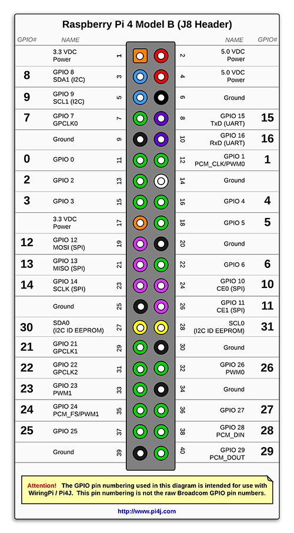

# Development Branch For Lunabotics on Raspberry Pi (Ubuntu)

## Diagram of the Raspbery Pi 4 Model B Headers (J8 Headers)

## Diagram of the Setup

## Programs Used
- TigerVNC Server: <code>tigervnc-standalone-server</code>
- Xfce4 and it's utilities: <code>xfce4 xfce4-terminal xfce4-session</code>
- Xorg: <code>xserver-common xdg-utils xinit</code>
