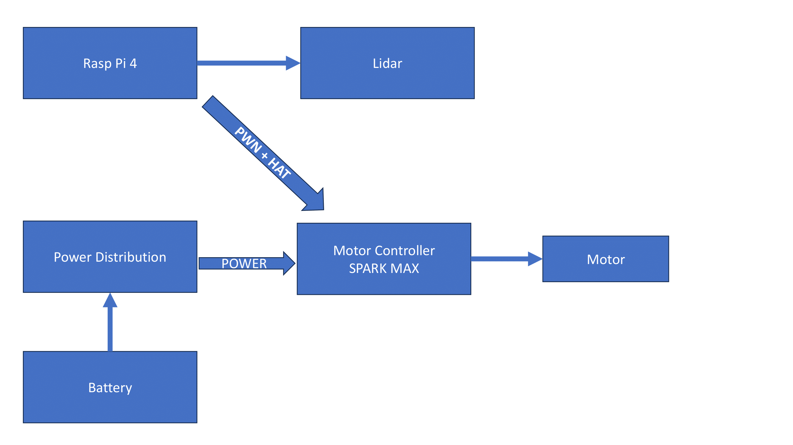

# Development Branch for Lunabotics

## Basic Diagram for interactions between hardware components

## Programs/Files Used
- [WPILib](https://github.com/wpilibsuite/allwpilib/releases)
    - [Documentaiton in C++](https://github.wpilib.org/allwpilib/docs/release/cpp/)